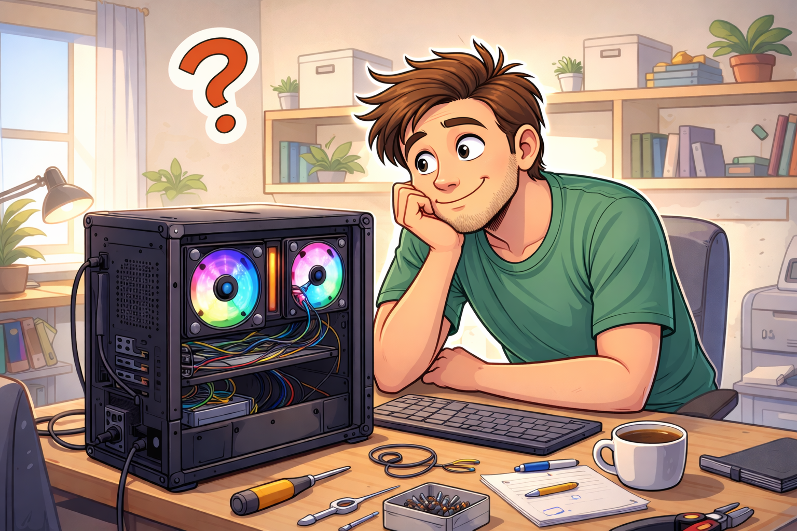

# Can You Self-Host an Efficient AI at Home or for your Company?

## Introduction

This started with a simple goal: run a genuinely useful local LLM on a home setup with a 12GB GPU. On paper, that sounds like "pick a model and press run." In reality, it turned into a chain of very practical engineering trade-offs across hardware, runtime setup, memory limits, and model quality.

This write-up is the path I took from first boot to a usable daily LLM. It goes through the messy parts first (driver issues, environment friction, runtime decisions), then the model-side experiments (8B baseline, quantized 20B, offloading, and quantization + offloading), plus a bonus test with AirLLM.

The main thread is simple: local LLMs are absolutely workable now, but "can run" and "feels good to use" are not the same thing. The episodes focus on where that gap appears, what improved it the most, and what still costs latency, RAM, or reliability when pushing beyond VRAM limits.

## Episode 1 — The rig (hardware gotchas)

The very first step was supposed to be simple: a 12GB GPU was installed so the LLM could run on it and actually feel pleasant to use. It's one of those upgrades that sounds optional on paper, but in practice it changes everything about the experience.

The short why-this-matters part is pretty straightforward. GPUs matter for LLMs because most of the heavy work is large-scale matrix math, and these processors are built to run that in parallel. That's why "faster" doesn't just mean one vague speed boost: it shows up as better TTFT (time to first token, the moment the model starts responding), and higher tokens/sec (how quickly the text keeps flowing after that). Tokens are just the little chunks of text the model reads and generates, including word pieces and punctuation, so when tokens come faster, the whole interaction feels more like a conversation and less like waiting on a loading bar.

The GPU was dropped into the PCIe x16 slot like any normal build... and then the motherboard pulled a prank: the onboard network chip basically disappeared. No internet, no updates. Fixing it was unglamorous: install the right driver, tweak the network config, and get the PCI bus behaving again.

## Episode 2 — The missing piece: an inference runtime (Ollama)

Now that the hardware was set up, it was tempting to think the rest would be straightforward: grab a model, use PyTorch, point it at the GPU, and go. In the end, that "model + PyTorch + GPU" path didn't feel smooth at all. A lot of time got spent on the software environment instead of actually running anything: CUDA versions, container images, and the usual "it works on this machine, not on that one" kind of friction.

Docker wasn't really mandatory, but it quickly became the preferred choice to keep the setup from turning into a mess, and `nvidia-smi` became the sanity check for what the GPU and VRAM were actually doing. But the bigger shift was realizing I didn't want "a script that loads a model", I wanted "a service that reliably serves a model".

That ended up being the missing piece: an inference runtime. An LLM runtime (or inference engine) is basically the part that handles the boring-but-critical details: loading models in the right format, managing memory, keeping the GPU fed, sometimes batching requests, and exposing a simple interface so other tools can talk to it without caring about the internals. For most people, that's the difference between "possible" and "pleasant". Docker fits nicely into that workflow too; with a runtime in place, the whole stack stops feeling like a science project.

The other half of the puzzle was the agent side. An AI agent (Goose, in my case) isn't just a chatbot; it can plan and take actions to achieve a goal, use tools like apps or code, and handle multi-step workflows. There are several open-source agents with either a GUI or a CLI.

What got set up in the end was pleasantly simple: an Ollama Docker container with GPU access, volumes for model storage, and one port exposed so the agent could talk to it. With that, the system stopped being a pile of moving parts and started feeling like a stable base to build experiments on.

## Episode 3 — My first win: small models (8B)

After the inference engine was finally up and running, it just needed to be fed models. A few 8B options were found on Hugging Face and downloaded, and that first local chat was the moment everything started to feel real. The replies came back instantly, almost too instantly, and for a minute it genuinely felt like having a tiny JARVIS at home.

That "wow" feeling didn't last long, though. The speed was real, but the answers tended to be short, a bit shallow, and quick to fall apart once anything slightly complicated was asked. It was still a win, proof that a usable local assistant was possible, but the limitations showed up fast, like reality knocking on the door right after the magic trick landed.

More trouble started when tools entered the chat. Tool-calling steps are mostly: "choose a tool, format the call, pass sane args, interpret results, recover from errors". That's a lot of planning and self-correction, and at 8B the boring failure modes showed up constantly: malformed calls, wrong parameters, and losing the thread mid-workflow. As far as I understood, smaller models are typically less robust at using tools and recovering from errors.

A lot of that comes down to what "8B" actually means. Those labels (8B, 13B, 32B, ...) are basically shorthand for the number of parameters: the learned numerical weights inside the model. Billions of tiny values are sitting there shaping each generated token. Each parameter has to live somewhere in memory, so bigger parameter counts usually mean higher RAM or VRAM needs. Operationally, model size and memory pressure end up being tied together, which is why the "how many B?" question quickly turns into "will this fit on my GPU?"

The best experiences at that size were the practical, lightweight ones. Adding speech-to-text made it fun to just talk to the model for quick Q&A. Some runs even showed a bit of reasoning, and it was genuinely handy for summarizing, translating, and explaining things without waiting around. It just needed the tasks to stay within a certain complexity band, because once tools and multi-step workflows entered the picture, the cracks showed.

And of course, the next question showed up immediately: is that the limit with 12GB of VRAM? Hopefully not. That's where the next set of tricks started looking a lot more interesting.

## Episode 4 — The power-up: quantization (20B at 4-bit)

This was the day when a simple download ended up feeling like a real upgrade. Instead of fighting VRAM limits, a pre-quantized model was picked up directly: a 20B model in 4-bit (Q4). Coming from an 8B model, the jump was immediate: it ran smoothly, and it finally started to feel "useful" for everyday local work.

The main lesson here is pretty straightforward: quantization is the highest-leverage trick available for now. It's the rare change that buys a big capability bump per GB, without requiring new hardware.

Under the hood, quantization reduces VRAM usage by storing model parameters in lower precision (for example, 8-bit or 4-bit instead of 16-bit). That smaller representation shrinks memory needs, usually with only minor quality loss. Not all models react the same way: architecture and training matter a lot. In practice, degradation varies by architecture, task, and quantization method; well-calibrated models often degrade less than poorly calibrated ones.

These quality loss percentages reflect near-optimal research setups with careful tuning, inferred from public articles [1]. In real-world runs, the loss numbers vary with model size, architecture, calibration data, and quantization scheme. They are also task- and benchmark-dependent, so they should be treated as indicative trends, not universal values, to help frame the trade-off.

| Quantization | Quality loss (approx.) | VRAM saved (approx.) |
|--------------|------------------------|----------------------|
| FP16         | Baseline (0%)          | 0%                   |
| 8-bit (INT8) | ~0–1%                  | ~50%                 |
| 6-bit        | ~1–3%                  | ~62%                 |
| 4-bit (Q4)   | ~3–10%                 | ~75%                 |
| ≤3-bit       | 10%+                   | ~80–85%              |

The practical "how" question is the next part: quantization can be applied in three ways: download pre-quantized weights, quantize yourself, or enable it at load time. In this case, the pre-quantized route was taken, and it made the whole thing almost boringly easy.

It's also worth admitting the common warning: aggressive quantization can reduce factual reliability in some setups. Even if that's true in a given setup, it didn't have to be a dealbreaker. A few prompting habits tended to help in a practical way (at the cost of extra tokens): asking for explicit assumptions, requesting a quick self-check before finalizing, and pushing for "say you don't know" when something can't be verified. Not glamorous, but it kept things usable.

And usability is really what improved most. With the ~20B Q4 model, tool-use reliability in Model Context Protocol (MCP) workflows felt noticeably better, answers got longer without turning into fluff, and reasoning/coding started landing more often. It finally felt like something genuinely useful was running locally.

## Episode 5 — The giant: offloading (when the model doesn't fit)

The first time I tried loading 20B-class models onto a GPU without enough VRAM, it worked... technically. The model answered, and quality felt similar to quantized runs, but the system was unbalanced: CPUs pegged, fans spinning, and the GPU barely doing anything. It was the classic "it responds, but it's slow" failure mode, with lots of work happening, just not where I expected.

The takeaway: offloading lets you run bigger models, but it can wreck latency and usability. Fitting isn't the same as feeling fast.

Offloading is what makes oversized models possible on limited VRAM. Instead of keeping everything on the GPU, some model weights and/or the KV cache (the stored attention keys/values used to speed generation) can live in system RAM, or even on disk, and be copied to the GPU as needed. That lowers VRAM needs, but transfer overhead and CPU work slow the model's thinking.

## Episode 6 — The fusion dance (run the model above)

Then I took it to the extreme: quantization + offloading, pushing the hardware. A 30B model quantized at Q4 was tried, needing roughly 7GB of RAM + 12GB of VRAM to make the whole thing work. With the prompt "Hello, can you explain to me how blockchain works please?", it took about 15 seconds before the first token showed up (TTFT). After that, it streamed 597 words in under 57 seconds, which works out to just over 10 words per second (~14 tokens/s). During that run, the GPU hovered at around 30% usage, while the CPUs basically never stopped. That was a good shot, and greedier attempts to offload more to RAM slowed everything down.

The fusion recipe depends on the GPU model, PCIe vs. NVLink bandwidth, batch size, context length, and whether latency or throughput is the real priority. A practical approach is to choose or build a solid 4-bit quantized model whose weight size slightly exceeds available VRAM, then offload just enough to system RAM to keep some VRAM free for the KV cache. If performance feels slow, shorten the context or move to a smaller model. A fully GPU-resident model will almost always feel smoother.

## Bonus episode — AirLLM (streaming layers from RAM)

AirLLM came up once VRAM was clearly the bottleneck. In this setup, it was tested as an alternative to Ollama to solve the memory problem differently: the model doesn't have to live in GPU memory all at once. Instead, it streams weights layer by layer: load, run, free, then repeat. VRAM use drops hard, and "too-big" models on small GPUs start to look doable. In principle, it works.

The catch showed up immediately: it's too slow. Not broken, just high latency that makes a chatty workflow painful, because every back-and-forth pays the price.

Bottom line: streaming trades memory for time. Great for "can this run?" experiments, rough for daily use.

## Back to the inn (let's take stock)

The honest takeaway is that self-hosting LLMs is now practical and powerful, but it's still very much a game of trade-offs. It tends to come down to VRAM/RAM/latency/capability, and those constraints don't magically disappear just because the model is running locally.

For the low-cost setup, thanks to quantization, modern mid-range models can feel surprisingly good: fast, private, and affordable assistants with tool use. More advanced models usually bring noticeably stronger reasoning, but that strength is often paid for with higher VRAM needs and more latency introduced by offloading.

From a company perspective, it's also pretty clear why local hosting starts looking attractive once usage grows. A strong local LLM can be run with a reasonable investment. For many production workloads, 96GB of VRAM can be a practical entry point for a stronger reliability/capability tier. It should reduces long-term per-token costs while keeping data private. That doesn't make it free or effortless; a clean multi-user, multi-model setup is key to efficiency and scalability, and an engine like vLLM plus appropriate tooling can reduce integration overhead.

And the journey isn't over. Having a working local LLM that fits the hardware is basically the first step. Next, the interesting upgrades are in efficiency and usefulness: MCP/tooling so the model can actually do things, agent workflows for longer tasks, setting up a multi-model workflow with one general-purpose model and one expert model, RAG for grounded answers on private docs, and fine-tuning/training if repeated patterns keep showing up. That's where local setups start to feel less like a demo and more like something you can actually build on.

## References
[1]:
- https://arxiv.org/abs/2306.00978
- https://arxiv.org/abs/2303.08302
- https://arxiv.org/abs/2210.17323
- https://arxiv.org/abs/2208.07339
- https://arxiv.org/abs/2305.14314
- https://arxiv.org/abs/2211.10438
- https://arxiv.org/abs/2206.01861
